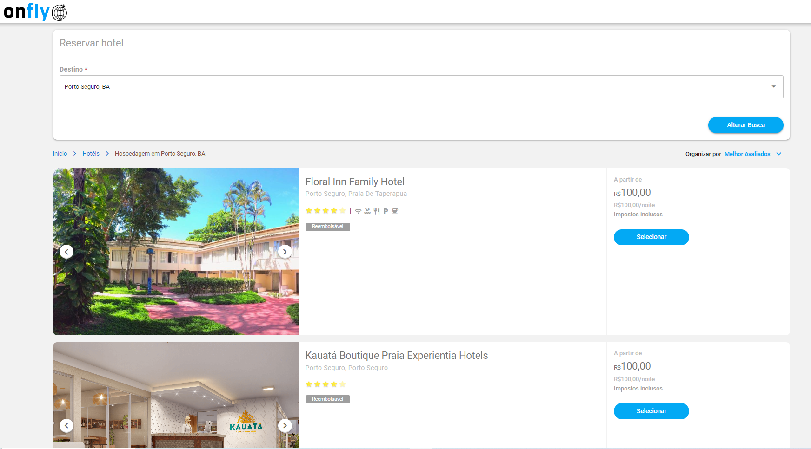

# teste-vuejs-onfly

Teste de busca e componentização, usando VueJS, Quasar

<p align="center">
  
</p>

<h3 align="center">Enunciado:</h3>

<p align="left">
  <div>
    
  <div>
  <div>
    
  <div>
  <div>
    
  <div>
</p>

<h3 align="center">Prints:</h3>

<p align="center">
  <div>
    
  <div>
  <div>
    
  <div>
</p>

### Palavras Chave

- ⚡️ [Vue 3](https://vuejs.org/) & [Quasar](https://quasar.dev/)
- 📑 [Vue-Router](./src/routes/index.js)
- [Pinia](https://pinia.vuejs.org/)

## ⚒️ Instalação ⚒️

1. Instalar Quasar

   ```bash
   yarn create quasar [for yarn]

   # npm init quasar [for npm]
   ```

1. Instalar todos pacotes

   ```bash
   yarn install [for yarn]

   # npm install [for npm]
   ```

1. Executar servidor de desenvolvimento

   ```bash
   yarn dev

   # npm run dev [for npm]
   ```

## Executar localmente

Clonar o Projeto

```bash
  git clone https://github.com/silassantos21/teste-vuejs-onfly.git
```

Ir para o Repositório do projeto

```bash
  cd teste-vuejs-onfly
```

Instalar dependências

```bash
  yarn ou npm install
```

Iniciar o server

```bash
  yarn dev ou npm run dev
```
